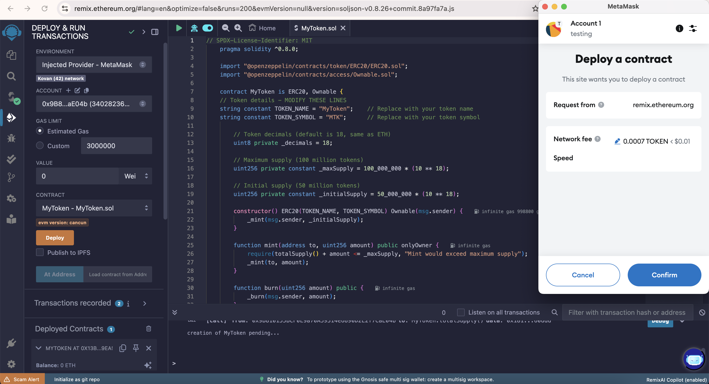
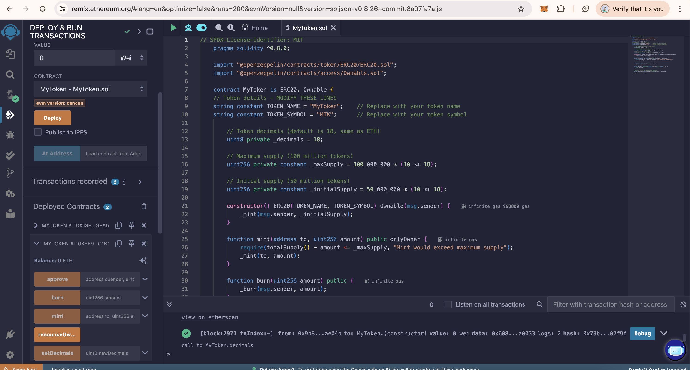
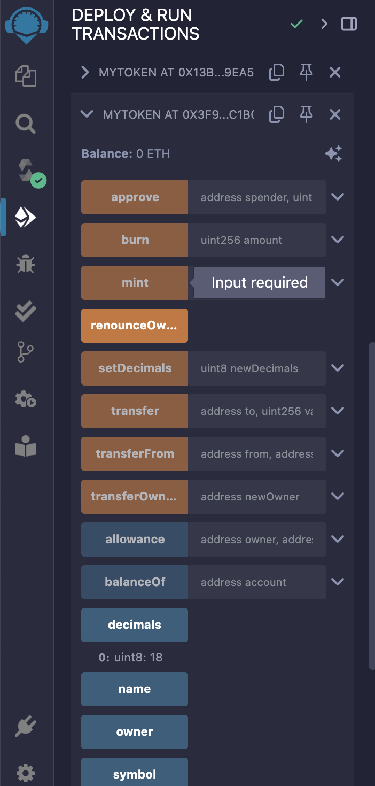

# Quantum-Resistant Smart Contracts on Quantova Network

## **Overview**

Quantova Network enables developers to deploy and execute [**quantum-resistant smart contracts**](#step-2-deploying-a-token-contract-on-the-quantova-network) using tools like Remix
and Hardhat. The blockchain integrates post-quantum cryptography (PQC) into its EVM environment to secure contract
logic, storage, and transactions against quantum attacks.

---

## **Key Quantum-Resistant Features**

### **1. Transaction Signing & Authentication**

- **Replaced Algorithm**: ECDSA (vulnerable to Shor’s Algorithm).
- **Post-Quantum Signatures**:
    - **Dilithium**: For high-security applications (e.g., governance contracts).
    - **FALCON**: For gas-efficient, compact signatures (e.g., token transfers).
    - **Rainbow**: For lightweight authentication in high-throughput contracts.

| **Signature Scheme** | Use Case        | Public Key Size | Signature Size |  
|----------------------|-----------------|-----------------|----------------|  
| Dilithium2           | Governance      | 1,312 bytes     | 2,420 bytes    |  
| FALCON-512           | Token Transfers | 897 bytes       | 666 bytes      |  
| Rainbow-III          | High-Throughput | 157 KB          | 164 bytes      |  

### **2. Quantum-Resistant Hashing**

- **Replaced Algorithm**: Keccak-256 (SHA-3 variant with weaker collision resistance).
- **Post-Quantum Hash**: **SHA3-256** (resists Grover’s Algorithm).
    - **Collision Resistance**: 128-bit security against quantum attacks.
    - **Storage Integrity**: Used in Merkle trees for contract state verification.

## **Workflow: Deploying a Quantum-Resistant Contract**

### **Step 1: Development Tools**

- **Remix**: Use the [Remix Plugin](https://remix.ethereum.org/) for PQC-aware compilation.
- **Hardhat**: Install the `hardhat-quantova` plugin for quantum-resistant deployments.
  ```bash
  npm install hardhat-quantova
  ```

### **Step 2: Deploying a Token Contract on the Quantova Network**

To deploy a token contract on the Quantova Network, follow these steps:

1. **Set Up Your Wallet:**
    - Ensure you have an Ethereum-compatible wallet such as MetaMask installed.

2. **Connect to the Quantova Network:**
    - Open MetaMask and navigate to **Settings** → **Networks** → **Add Network**.
    - Enter the following details:
        - **Network Name:** Quantova Network
        - **New RPC URL:** [https://rpc.quantova.org](https://rpc.quantova.org)
        - **Chain ID:** QTOV20
        - **Symbol:** QTOV
        - **Block Explorer URL:** [QtovaScan.io](https://QtovaScan.io)

3. **Fund Your Wallet with GRD:**
    - Ensure your wallet has GRD tokens to cover transaction fees.

4. **Deploy the Token Contract:**
    - Open [Remix IDE](https://remix.ethereum.org/) in your browser.
    - Copy and paste the following Solidity contract into a new file:

   ```solidity
   // SPDX-License-Identifier: MIT
    pragma solidity ^0.8.0;
    
    import "@openzeppelin/contracts/token/ERC20/ERC20.sol";
    import "@openzeppelin/contracts/access/Ownable.sol";
    
    contract MyToken is ERC20, Ownable {
    // Token details - MODIFY THESE LINES
    string constant TOKEN_NAME = "MyToken";    // Replace with your token name
    string constant TOKEN_SYMBOL = "MTK";      // Replace with your token symbol
    
        // Token decimals (default is 18, same as ETH)
        uint8 private _decimals = 18;
        
        // Maximum supply (100 million tokens)
        uint256 private constant _maxSupply = 100_000_000 * (10 ** 18);
        
        // Initial supply (50 million tokens)
        uint256 private constant _initialSupply = 50_000_000 * (10 ** 18);
    
        constructor() ERC20(TOKEN_NAME, TOKEN_SYMBOL) Ownable(msg.sender) {
            _mint(msg.sender, _initialSupply);
        }
    
        function mint(address to, uint256 amount) public onlyOwner {
            require(totalSupply() + amount <= _maxSupply, "Mint would exceed maximum supply");
            _mint(to, amount);
        }
    
        function burn(uint256 amount) public {
            _burn(msg.sender, amount);
        }
    
        function decimals() public view virtual override returns (uint8) {
            return _decimals;
        }
    
        // Optional: Function to change decimals (only owner)
        function setDecimals(uint8 newDecimals) public onlyOwner {
            _decimals = newDecimals;
        }
    }
    ```

5. **Compile and Deploy:**
    - Open **Remix IDE** and select the appropriate Solidity compiler version.
    - Click **Compile** and ensure there are no errors in the contract.
    - In the **Deploy & Run Transactions** tab, select **Injected Web3** as the environment.
    - Connect MetaMask to the Quantova Network and deploy the contract.




6. **Interact with the Contract:**
    - Once deployed, you can interact with the contract using:
        - **Remix IDE** – Execute contract functions directly.
        - **Quantova Block Explorer** – View contract details and transactions.
        - **Web3 Libraries** – Use **ethers.js** or **web3.js** to build dApps that interact with the contract.



### **Step 3: Deploying an NFT on the Quantova Network**

You can also deploy an NFT contract on the Quantova Network by following a similar process.  
Refer to the sample contract below, customize it as per your requirements, and deploy it using **Remix IDE**.

```solidity
   // SPDX-License-Identifier: MIT
    pragma solidity ^0.8.20;
    
    import "@openzeppelin/contracts/token/ERC721/ERC721.sol";
    import "@openzeppelin/contracts/token/ERC721/extensions/ERC721URIStorage.sol";
    import "@openzeppelin/contracts/access/Ownable.sol";
    
    contract MyNFT is ERC721URIStorage, Ownable {
        // NFT Collection details
        string constant private TOKEN_NAME = "MyNFTCollection";
        string constant private TOKEN_SYMBOL = "MNFT";
        
        // Price per NFT in wei (0.01 ETH)
        uint256 public constant MINT_PRICE = 0.01 ether;
        
        // Maximum supply of NFTs
        uint256 public constant MAX_SUPPLY = 10000;
        
        // Current token ID
        uint256 private tokenId;
    
        constructor() ERC721(TOKEN_NAME, TOKEN_SYMBOL) Ownable(msg.sender) {}
    
        // Mint function for public
        function mint() public payable returns (uint256) {
            require(msg.value >= MINT_PRICE, "Not enough ETH sent");
            require(tokenId < MAX_SUPPLY, "Max supply reached");
            
            tokenId++;
            _safeMint(msg.sender, tokenId);
            
            return tokenId;
        }
    
        // Mint function for owner (free minting)
        function ownerMint(address to) public onlyOwner returns (uint256) {
            require(tokenId < MAX_SUPPLY, "Max supply reached");
            
            tokenId++;
            _safeMint(to, tokenId);
            
            return tokenId;
        }
    
        // Set token URI
        function setTokenURI(uint256 _tokenId, string memory _tokenURI) public onlyOwner {
            _setTokenURI(_tokenId, _tokenURI);
        }
    
        // Withdraw funds from contract
        function withdraw() public onlyOwner {
            uint256 balance = address(this).balance;
            payable(owner()).transfer(balance);
        }
    
        // Get current token ID
        function getCurrentTokenId() public view returns (uint256) {
            return tokenId;
        }
    }
```

