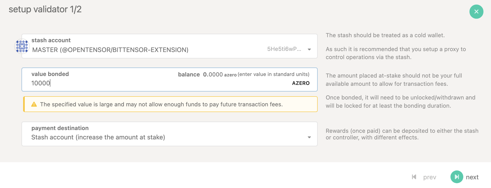
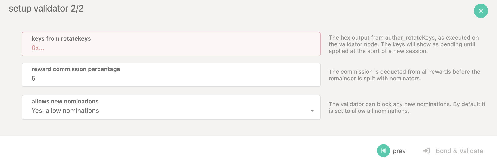

# **Setting Up a Node/Validator on the Gradium Network**

This guide will help you set up a [full node](#4-start-a-full-node) or a [validator node](#5-set-up-a-validator-node) on the [**Gradium Network**](https://Gradium.io).

---

## **1. System Requirements**
Ensure your system meets the following requirements:

### Minimum Hardware Requirements

Polkadot validators require high-performance hardware to efficiently process blocks and maintain network stability. Below are the recommended minimum hardware specifications to ensure optimal performance.

#### **CPU**
- **Architecture:** x86-64 compatible  
- **Cores:** Eight physical cores @ 3.4 GHz  
- **Processor Recommendations:**  
  - **Intel:** Ice Lake or newer (Xeon or Core series)  
  - **AMD:** Zen3 or newer (EPYC or Ryzen)  
- **Multithreading:**  
  - **Intel:** Disable Hyper-Threading  
  - **AMD:** Disable SMT  
- **Priority:** Single-threaded performance is prioritized over core count.

#### **Storage**
- **Type:** NVMe SSD (prioritize low latency over high throughput)  
- **Capacity:** At least **1 TB** for blockchain data  
- **Note:** Storage requirements will **increase over time** as the chain grows. For current estimates, refer to the [latest chain snapshot](https://polkadot.network).

#### **Memory**
- **Capacity:** 32 GB DDR4 **ECC**  

#### **Network**
- **Speed:** **500 Mbit/s symmetric** (upload & download)  
- **Requirement:** Ensures the ability to handle large numbers of parachains and prevent congestion during peak times.  

Ensure your validator meets or exceeds these requirements for optimal network performance.

---

## **2. Install Dependencies**
Before running a node, install the required dependencies:

### **Ubuntu / Debian**
```sh
sudo apt update && sudo apt upgrade -y
sudo apt install -y curl wget git build-essential
```

### **MacOS**
```sh
brew update
brew install curl wget git
```

---

## **3. Download and Install the Gradium Node Software**
```sh
git clone https://github.com/GradeLabz/gradium-node.git
cd gradium-node
chmod +x install.sh
./install.sh
```
This script will install and configure the Gradium node software automatically.

---

## **4. Start a Full Node**
Run the following command to start a full node:

### Generate the keys for the node:

Generate the Keys for the node like babe, grandpa, im_online and authority keys.
you can follow this [link](https://polkadot-blockchain-academy.github.io/pba-book/cryptography/_materials/subkey-demo.html) to generate the keys.

### Insert the keys for the node:

```sh
./target/release/gradium-node key insert 
  --base-path /<nodedbname> \
  --chain <chainspec location> \
  --scheme Sr25519 \
  --suri <key> \
  --password-interactive \
  --key-type babe

./target/release/gradium-node key insert 
--base-path /<nodedbname> \
  --chain <chainspec location> \
  --scheme Ed25519 \
  --suri <key> \
  --password-interactive \
  --key-type gran
  
 ./target/release/gradium-node key insert 
 --base-path /<nodedbname> \
  --chain <chainspec location> \
  --scheme Sr25519 \
  --suri <key> \
  --password-interactive \
  --key-type imonline
  
  ./target/release/gradium-node key insert 
  --base-path /<nodedbname> \
  --chain <chainspec location> \
  --scheme Sr25519 \
  --suri <key> \
  --password-interactive \
  --key-type authority-discovery
```

### Start the node:

```sh
./target/release/gradium-node \                                               
  --base-path /<nodedbname> \
  --chain <chainspec location> \
  --port 30334 \
  --rpc-port 9946 \
  --telemetry-url "wss://telemetry.polkadot.io/submit/ 0" \
  --rpc-methods Unsafe \
  --name nodename \
  --bootnodes /ip4/127.0.0.1/tcp/30333/p2p/<bootnode key>

```

## **5. Set Up a Validator Node**
To become a validator, follow these steps:

### Generate a validator key: 
- Generate the Keys for the node like babe, grandpa, im_online and authority keys.
- you can follow this [link](https://polkadot-blockchain-academy.github.io/pba-book/cryptography/_materials/subkey-demo.html) to generate the keys.

### Insert the keys for the node:

```sh
./target/release/gradium-node key insert --base-path /<nodedbname> \
  --chain <chainspec location> \
  --scheme Sr25519 \
  --suri <key> \
  --password-interactive \
  --key-type babe

./target/release/gradium-node key insert --base-path /<nodedbname> \
  --chain <chainspec location> \
  --scheme Ed25519 \
  --suri <key> \
  --password-interactive \
  --key-type gran
  
 ./target/release/gradium-node key insert --base-path /<nodedbname> \
  --chain <chainspec location> \
  --scheme Sr25519 \
  --suri <key> \
  --password-interactive \
  --key-type imonline
  
  ./target/release/gradium-node key insert --base-path /<nodedbname> \
  --chain <chainspec location> \
  --scheme Sr25519 \
  --suri <key> \
  --password-interactive \
  --key-type authority-discovery
```

### Start the Validator Node:

```sh
./target/release/gradium-node \                                               
  --base-path /<nodedbname> \
  --chain <chainspec location> \
  --port 30334 \
  --rpc-port 9946 \
  --telemetry-url "wss://telemetry.polkadot.io/submit/ 0" \
  --validator \
  --rpc-methods Unsafe \
  --name MyNode02 \
  --bootnodes /ip4/127.0.0.1/tcp/30333/p2p/<bootnode key>

```

### Register Your Validator Node
Register your validator node by submitting all the required details, including the commission rate and the amount of GRD to be staked.


### Generate and Rotate Keys



After registering, wait for the next epoch. Once the epoch changes, your validator will be added to the pool of active validators on the Gradium Chain.

---

## **9. Additional Resources**
- [Gradium Explorer](https://GRQScan.io) – Check node status
- [Gradium Docs](https://gradium.io/docs) – Official documentation
- [Community Support](https://gradium.io/community) – Get help from the community

For further questions, contact **Gradium Support** at [info@gradium.io](mailto:info@gradium.io).